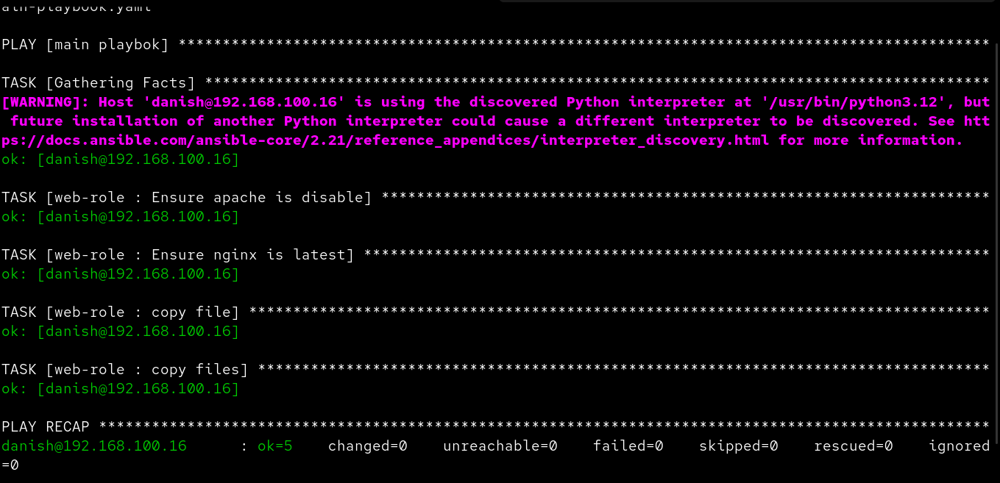
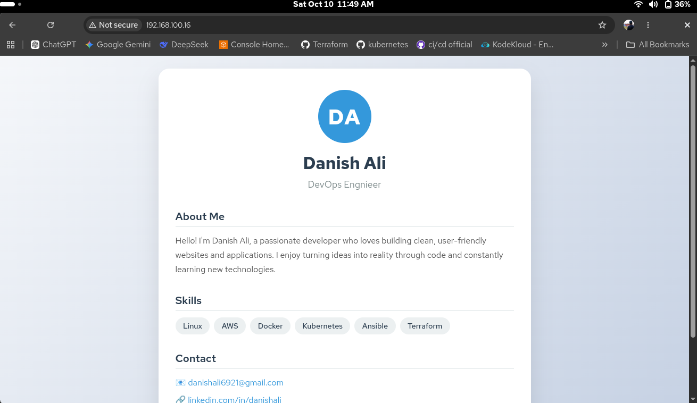

# Dynamic Configs with Templates — Ansible Nginx Deployment


> An Ansible project that automates the deployment of a personal portfolio website on a remote Ubuntu host using Nginx — stopping Apache conflicts, installing Nginx, deploying a dynamic config, and serving a static portfolio page, all in a single playbook run.

---

## Table of Contents

- [Overview](#overview)
- [Project Structure](#project-structure)
- [Prerequisites](#prerequisites)
- [Inventory](#inventory)
- [Role: web-role](#role-web-role)
  - [Tasks](#tasks)
  - [Nginx Config Template](#nginx-config-template)
  - [Handler](#handler)
  - [Defaults & Vars](#defaults--vars)
- [How to Run](#how-to-run)
- [Screenshots](#screenshots)
- [Architecture Flow](#architecture-flow)
- [Notes & Gotchas](#notes--gotchas)

---

## Overview

This project uses an Ansible role (`web-role`) to fully automate the process of:

1. Stopping and disabling any conflicting Apache service
2. Installing (or upgrading) Nginx to the latest version
3. Deploying a custom Nginx server block config to `/etc/nginx/conf.d/website.conf`
4. Serving a self-contained personal portfolio HTML page from `/var/www/html/`

The playbook targets a single host (`192.168.100.16`) in the `danish` inventory group and uses `become: yes` to run all tasks with elevated privileges.

---

## Project Structure

```
dynamic-configs-with-templates/
├── inventory.ini               # Target host definition
├── main-playbook.yaml          # Entry point playbook
└── web-role/                   # Ansible role
    ├── defaults/
    │   └── main.yml            # Default variables (ansible_user)
    ├── files/
    │   └── index.html          # Static portfolio HTML page
    ├── handlers/
    │   └── main.yml            # Nginx service handler
    ├── meta/
    │   └── main.yml            # Role metadata
    ├── tasks/
    │   └── main.yml            # All deployment tasks
    ├── templates/
    │   └── nginx.conf.j2       # Nginx server block config (Jinja2 template)
    ├── tests/
    │   ├── inventory           # Test inventory
    │   └── test.yml            # Test playbook
    └── vars/
        └── main.yml            # Role-level variables
```

---

## Prerequisites


| Requirement | Details |
|---|---|
| Ansible | >= 2.2 |
| Control node OS | Linux / macOS |
| Managed node OS | Ubuntu (tested) |
| SSH access | Password or key-based to `192.168.100.16` |
| Sudo privileges | Required on the remote host |

---

## Inventory

```ini
# inventory.ini
[danish]
192.168.100.16
```

A single host group `danish` pointing to a local network machine (VM or homelab server). The SSH user is set in the role defaults:

```yaml
# web-role/defaults/main.yml
ansible_user: danish
```

---

## Role: web-role

### Tasks

Four tasks run in sequence (`web-role/tasks/main.yml`):

| # | Task | Module | Action |
|---|---|---|---|
| 1 | Stop & disable Apache | `ansible.builtin.service` | Prevents port 80 conflicts with Nginx |
| 2 | Install / upgrade Nginx | `ansible.builtin.apt` | Ensures `state: latest` |
| 3 | Deploy Nginx config | `ansible.builtin.copy` | Copies `nginx.conf.j2` → `/etc/nginx/conf.d/website.conf` |
| 4 | Deploy index.html | `ansible.builtin.copy` | Copies `index.html` → `/var/www/html/` |

Tasks 3 and 4 both notify the `nginx-service` handler when a file changes. Ansible deduplicates the notification — Nginx restarts at most once per play.

---

### Nginx Config Template

```nginx
# web-role/templates/nginx.conf.j2
server {
    listen 80;
    server_name _;
    root  /var/www/html;
    index index.html;

    location / {
        try_files $uri $uri/ =404;
    }
}
```

| Setting | Value | Notes |
|---|---|---|
| Port | `80` | HTTP only; no TLS configured |
| `server_name` | `_` | Catch-all — responds to any hostname or IP |
| Document root | `/var/www/html` | Standard Ubuntu Nginx path |
| Index | `index.html` | Serves the portfolio page |
| Deployed to | `/etc/nginx/conf.d/website.conf` | Auto-included by default Nginx config |

---

### Handler

```yaml
# web-role/handlers/main.yml
- name: nginx-service
  ansible.builtin.service:
    name: nginx
    state: started
    enabled: yes
```

Triggered only when a config or HTML file actually changes. Starts Nginx and ensures it auto-starts on boot.

---

### Defaults & Vars

```yaml
# web-role/defaults/main.yml
ansible_user: danish
```

`web-role/vars/main.yml` is intentionally empty — no role-level variables are defined beyond the SSH user default.

---

## How to Run

```bash
# 1. Clone the repository
git clone <your-repo-url>
cd dynamic-configs-with-templates

# 2. Verify connectivity
ansible -i inventory.ini danish -m ping

# 3. Run the playbook (dry-run first)
ansible-playbook -i inventory.ini main-playbook.yaml --check

# 4. Apply for real
ansible-playbook -i inventory.ini main-playbook.yaml
```

After a successful run, the portfolio page is available at:

```
http://192.168.100.16/
```

---

## Screenshots

### Playbook Execution Output



> Ansible playbook running the `web-role` tasks — installing Nginx, deploying the config, and triggering the handler.

---

### Live Website



> The personal portfolio page served by Nginx at `http://192.168.100.16/` after a successful playbook run.

---

## Architecture Flow

```
ansible-playbook -i inventory.ini main-playbook.yaml
        │
        ▼
inventory.ini
└── [danish] → 192.168.100.16

main-playbook.yaml
└── hosts: danish | become: yes
    └── role: web-role
            │
            ├── Task 1: Stop & disable apache2
            ├── Task 2: apt install/upgrade nginx (latest)
            ├── Task 3: Copy nginx.conf.j2 ──→ /etc/nginx/conf.d/website.conf ──┐
            └── Task 4: Copy index.html    ──→ /var/www/html/index.html         ─┤
                                                                                  │ (on change)
                                                                                  ▼
                                                               Handler: nginx-service
                                                               (nginx: started + enabled)
                                                                       │
                                                                       ▼
                                                       http://192.168.100.16/ ✓
```

---

## Notes & Gotchas

| Topic | Detail |
|---|---|
| `copy` vs `template` | Task 3 uses `ansible.builtin.copy`, not `ansible.builtin.template`. The `.j2` file is copied verbatim — Jinja2 variables are not rendered. Switch to `template` if you add `{{ variables }}` to the config. |
| Apache stop task | Will fail if `apache2` is not installed on the target. Add `ignore_errors: yes` or a `service_facts` check if Apache may be absent. |
| No TLS | Port 80 only. To add HTTPS, extend `nginx.conf.j2` with an SSL server block and use `certbot` or copy your own certs. |
| Test scaffold | `tests/test.yml` references the role as `dynamic-configs-with-templates` — update to `web-role` to match the actual role directory name. |
| Variable precedence | `ansible_user` in `defaults/main.yml` is the lowest priority. Override it via inventory, `group_vars`, or `--extra-vars` as needed. |

---
