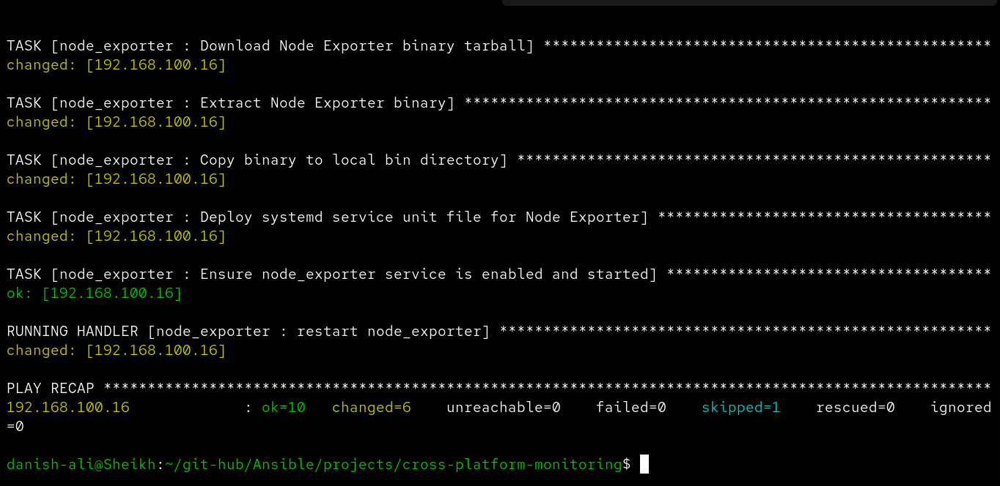
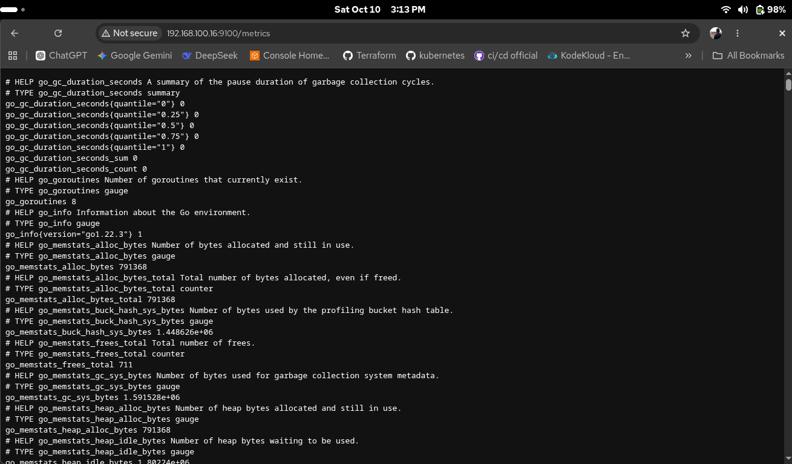

# 📊 Install & Configure Monitoring — Prometheus Node Exporter

<p align="center">
  
  
  
  
  
  
  
  
</p>

---

## 📋 Overview

This Ansible project automates the full installation and configuration of **Prometheus Node Exporter** on remote Linux hosts. It handles cross-platform package installation, binary deployment, dedicated system user/group creation, and systemd service management — all in a single playbook run.

Once deployed, Node Exporter exposes hardware and OS-level metrics at `http://<host>:9100/metrics`, ready to be scraped by a Prometheus server.

---

## 🖥️ Live Demo

### Ansible Playbook Run
> Successful execution against `192.168.100.16` — `ok=10  changed=6  failed=0`



### Metrics Endpoint Live
> Node Exporter serving Prometheus metrics at `192.168.100.16:9100/metrics`



---

## 🗂️ Project Structure

```
install-configure-monitoring/
├── main.yaml                          # Main playbook entry point
├── inventory.ini                      # Target host inventory
├── group_vars/
│   └── all.yml                        # Global variables (version, user, group)
└── node_exporter/                     # Ansible role
    ├── defaults/
    │   └── main.yml                   # Role defaults (extendable)
    ├── handlers/
    │   └── main.yml                   # Restart handler for systemd
    ├── meta/
    │   └── main.yml                   # Role metadata & Galaxy info
    ├── tasks/
    │   └── main.yml                   # All installation & config tasks
    ├── templates/
    │   └── node_exporter.service.j2   # Jinja2 systemd unit template
    ├── vars/
    │   └── main.yml                   # Role-level variables
    └── tests/
        ├── inventory                  # Test inventory (localhost)
        └── test.yml                   # Test playbook
```

---

## ⚙️ Variables

Defined in `group_vars/all.yml` — override them per-group or per-host as needed.

| Variable | Default | Description |
|---|---|---|
| `node_exporter_version` | `1.8.1` | Version of Node Exporter to install |
| `node_exporter_system_user` | `node_exporter` | Dedicated system user for the service |
| `node_exporter_system_group` | `node_exporter` | Dedicated system group for the service |

---

## 🚀 Task Flow

The role runs the following tasks in order:

| # | Task | Description |
|---|---|---|
| 1 | **Create system group** | Adds the `node_exporter` system group |
| 2 | **Create system user** | Adds a no-login, no-home system user |
| 3 | **Install dependencies (Ubuntu)** | Installs `wget` and `tar` via `apt` |
| 4 | **Install dependencies (RHEL/AlmaLinux)** | Installs `wget` and `tar` via `dnf` |
| 5 | **Download binary tarball** | Fetches the release from GitHub |
| 6 | **Extract binary** | Unpacks the tarball to `/tmp/` |
| 7 | **Copy binary** | Places binary at `/usr/local/bin/node_exporter` |
| 8 | **Deploy systemd unit** | Renders the `.service` file from Jinja2 template |
| 9 | **Enable & start service** | Enables and starts the service via `systemd` |

> The systemd unit deployment triggers the `restart node_exporter` **handler** automatically on any change.

---

## 🖧 Supported Platforms

The role uses conditional tasks to handle package installation across Debian and RedHat families:

- **Debian / Ubuntu** → `apt`
- **AlmaLinux / RHEL / CentOS** → `dnf`

---

## 📦 Requirements


- Ansible `>= 2.2`
- SSH access to the target host
- `become: true` (sudo) privileges on the target host
- Internet access on the target host to download the Node Exporter binary from GitHub

---

## 🔧 Configuration

### 1. Update the Inventory

Edit `inventory.ini` with your target host details:

```ini
[server]
192.168.100.16 ansible_user=danish
```

### 2. Set the Node Exporter Version

Edit `group_vars/all.yml` to pin the version:

```yaml
node_exporter_version: "1.8.1"
node_exporter_system_user: "node_exporter"
node_exporter_system_group: "node_exporter"
```

### 3. Run the Playbook

```bash
ansible-playbook -i inventory.ini main.yaml
```

To run with a specific SSH private key:

```bash
ansible-playbook -i inventory.ini main.yaml --private-key ~/.ssh/id_rsa
```

To do a dry run first:

```bash
ansible-playbook -i inventory.ini main.yaml --check
```

---

## 🌐 Verify the Deployment

Once the playbook finishes, verify Node Exporter is running and serving metrics:

```bash
# Check service status on the remote host
systemctl status node_exporter

# Curl the metrics endpoint
curl http://192.168.100.16:9100/metrics
```

Or open in a browser:

```
http://192.168.100.16:9100/metrics
```

You should see Prometheus-format metrics like `go_gc_duration_seconds`, `go_goroutines`, `go_memstats_alloc_bytes`, and hundreds of system-level metrics.

---

## 📁 Systemd Service Unit

The service is deployed from the Jinja2 template `node_exporter.service.j2`:

```ini
[Unit]
Description=Prometheus Node Exporter
After=network.target

[Service]
User={{ node_exporter_system_user }}
Group={{ node_exporter_system_group }}
Type=simple
ExecStart=/usr/local/bin/node_exporter

[Install]
WantedBy=multi-user.target
```

This ensures the process runs under the dedicated `node_exporter` user with minimal privileges.

---

## 🔄 Handlers

| Handler | Trigger | Action |
|---|---|---|
| `restart node_exporter` | Systemd unit file change | Reloads daemon and restarts the service |

---

## 📊 Play Recap (from live run)

```
192.168.100.16  :  ok=10   changed=6   unreachable=0   failed=0   skipped=1   rescued=0   ignored=0
```

| Metric | Value |
|---|---|
| Tasks OK | 10 |
| Tasks Changed | 6 |
| Unreachable | 0 |
| Failed | 0 |
| Skipped | 1 (OS-specific task not applicable) |

---

