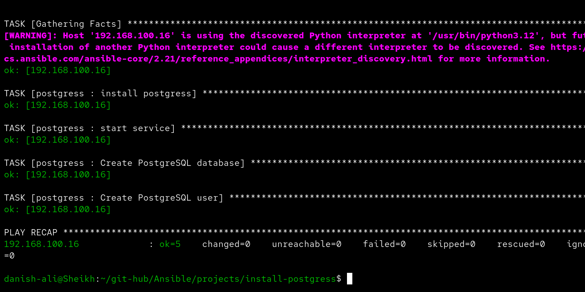
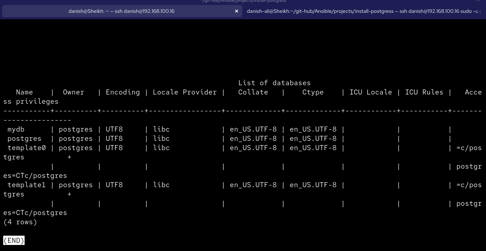

# 🐘 Ansible PostgreSQL Installation


> Automate the full installation and configuration of PostgreSQL on a remote Ubuntu server using an Ansible role. Installs packages, starts the service, creates a database, and sets up a user — all in one command.

---

## 📋 Table of Contents

- [Overview](#-overview)
- [Project Structure](#-project-structure)
- [Requirements](#-requirements)
- [Role Variables](#-role-variables)
- [Inventory Setup](#-inventory-setup)
- [Vault (Secrets)](#-vault-secrets)
- [Usage](#-usage)
- [What the Role Does](#-what-the-role-does)
- [Screenshots](#-screenshots)
- [Author](#-author)

---

## 🔍 Overview

This project uses an Ansible role (`postgress`) to automate PostgreSQL deployment on a Debian/Ubuntu-based remote host. It handles:

- Installing `postgresql`, `postgresql-contrib`, `libpq-dev`, and `python3-psycopg2`
- Enabling and starting the PostgreSQL `systemd` service
- Creating a database (`mydb`)
- Configuring a PostgreSQL user with credentials stored securely in Ansible Vault

---

## 📁 Project Structure

```
install-postgress/
├── main.yaml                   # Entry-point playbook
├── inventory.ini               # Host inventory (db group)
├── pass.vault                  # Vault password file
├── group_vars/
│   └── all/
│       └── main.yml            # Vault-encrypted variables (db creds)
└── postgress/                  # Ansible role
    ├── tasks/
    │   └── main.yml            # Core role tasks
    ├── handlers/
    │   └── main.yml            # Handlers (restart/reload)
    ├── defaults/
    │   └── main.yml            # Default variables
    ├── vars/
    │   └── main.yml            # Role-specific variables
    ├── meta/
    │   └── main.yml            # Role metadata
    ├── files/                  # Static files
    ├── templates/              # Jinja2 templates
    └── tests/
        ├── inventory           # Test inventory
        └── test.yml            # Test playbook
```

---

## ✅ Requirements

| Requirement | Details |
|---|---|
| **Control Node** | Ansible ≥ 2.2 |
| **Target OS** | Ubuntu / Debian |
| **Python** | python3 + `python3-psycopg2` (installed by the role) |
| **Privileges** | `become: yes` (sudo) required on target |
| **Connectivity** | SSH access to the target host |

---

## 🔧 Role Variables

These variables are consumed by the role tasks and must be defined (typically via Ansible Vault):

| Variable | Description |
|---|---|
| `db_host` | PostgreSQL host address |
| `db_port` | PostgreSQL port (default: `5432`) |
| `db_user` | PostgreSQL login username |
| `db_password` | PostgreSQL login password (**store in Vault**) |

Variables are stored encrypted in `group_vars/all/main.yml` using `ansible-vault`.

---

## 🗂 Inventory Setup

```ini
# inventory.ini
[db]
192.168.100.16 ansible_user=danish
```

The playbook targets the `db` host group defined in this inventory.

---

## 🔐 Vault (Secrets)

Sensitive credentials (`db_password`, etc.) are encrypted with **Ansible Vault** (AES256).

**Generate a strong random password using OpenSSL:**
```bash
openssl rand -hex 16
```
> This generates a 32-character cryptographically secure random hex string. Increase the number (e.g. `32`) for a longer password. Use this as your `db_password` before encrypting with Vault.

**To create/edit vault variables:**
```bash
ansible-vault edit group_vars/all/main.yml --vault-password-file pass.vault
```

**To encrypt a new file:**
```bash
ansible-vault encrypt group_vars/all/main.yml --vault-password-file pass.vault
```

**To view encrypted content:**
```bash
ansible-vault view group_vars/all/main.yml --vault-password-file pass.vault
```

---

## 🚀 Usage

**Run the playbook:**
```bash
ansible-playbook main.yaml -i inventory.ini --vault-password-file pass.vault
```

**Run with verbose output:**
```bash
ansible-playbook main.yaml -i inventory.ini --vault-password-file pass.vault -v
```

**Dry run (check mode):**
```bash
ansible-playbook main.yaml -i inventory.ini --vault-password-file pass.vault --check
```

---

## ⚙️ What the Role Does

The `postgress` role executes the following tasks in order:

```
1. Install PostgreSQL       → postgresql, postgresql-contrib, libpq-dev, python3-psycopg2
2. Start & Enable Service   → systemd: postgresql (started + enabled on boot)
3. Create Database          → Creates database: mydb  (become: postgres)
4. Create User              → Configures postgres user on mydb (become: postgres)
```

---

## 📸 Screenshots

### Playbook Execution — All Tasks OK

> All 5 tasks completed successfully on `192.168.100.16` with `ok=5`, `failed=0`.



---

### PostgreSQL Database Verification

> Connected to the remote server and confirmed `mydb` was created alongside the default system databases.



---

