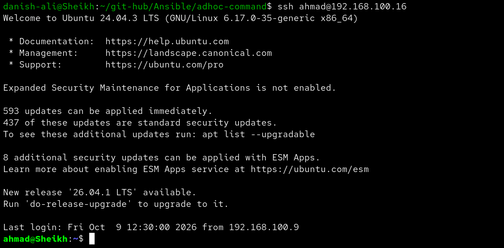
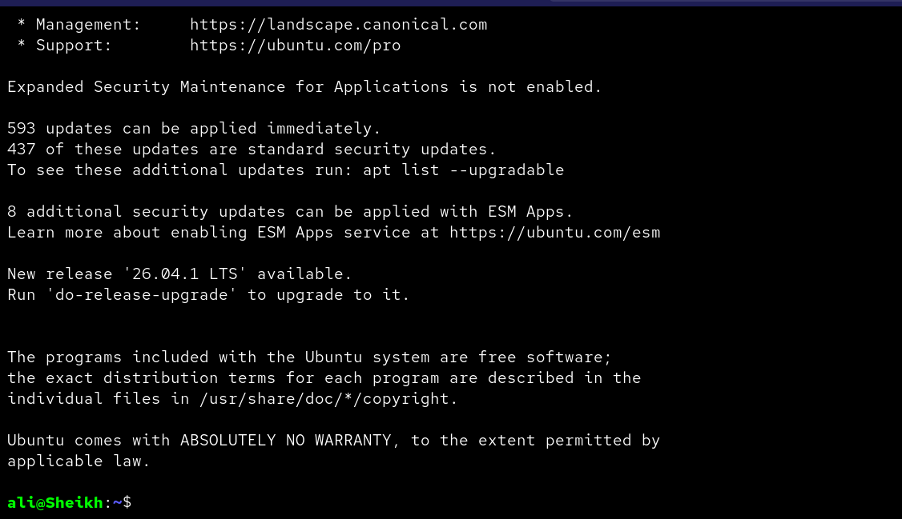
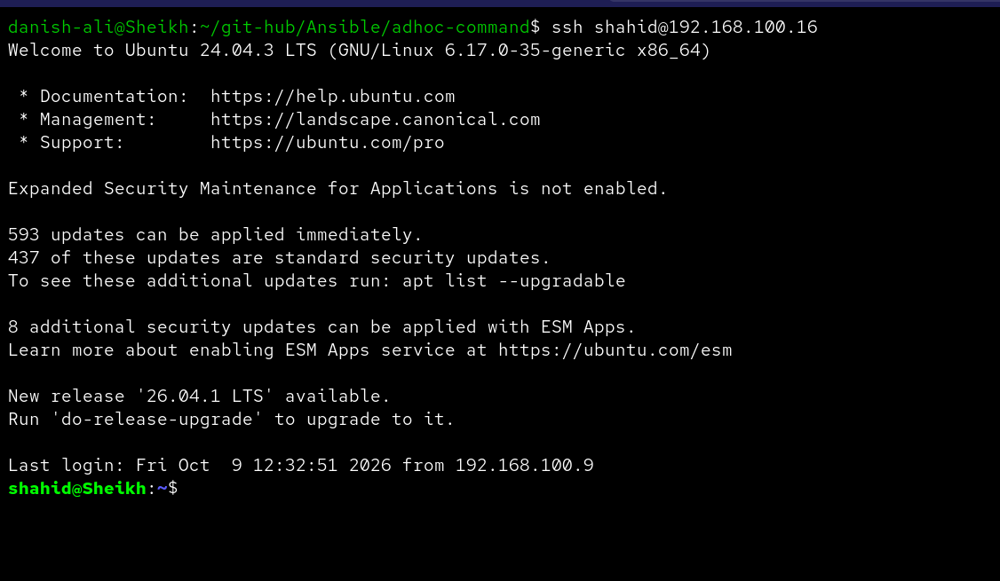

# Ansible User Automation — Passwordless SSH Login & Sudo Access


---

## Overview

This Ansible project automates the creation of Linux user accounts on a remote host, adds them to the **`sudo` group** for administrative privileges, and configures **passwordless SSH login** for each user by copying the controller's public key into their `authorized_keys` file.

Users created:
- `ahmad`
- `ali`
- `shahid`

All three users are appended to the `sudo` group, giving them full sudo access on the target host.

---

## Project Structure

```
user-automation/
├── inventory.ini        # Inventory file defining the target host
├── user-playbook.yaml   # Main Ansible playbook
├── ahmad-login.png      # Screenshot — ahmad passwordless login proof
├── ali-login.png        # Screenshot — ali passwordless login proof
├── shahid-login.png     # Screenshot — shahid passwordless login proof
└── README.md            # This file
```

---

## Inventory

**`inventory.ini`**

```ini
[danish]
danish@192.168.100.16
```

The target host is `192.168.100.16`, connected as user `danish` under the group `danish`.

---

## Playbook

**`user-playbook.yaml`**

```yaml
- name: create user and add make passwordless login  
  hosts: danish
  become: yes
  tasks:
    - name: create users
      ansible.builtin.user: 
       name: "{{ item }}"
       shell:  /bin/bash
       state: present
       groups: sudo
       append: yes
      loop:
         - ahmad  
         - ali  
         - shahid 
      ignore_errors: yes

    - name: Set up authorized keys for users
      ansible.posix.authorized_key:
        user: "{{ item }}"
        state: present
        key: "{{ lookup('file', '~/.ssh/id_rsa.pub') }}"
      loop:
        - ahmad
        - ali
        - shahid
```

### What it does

| Task | Module | Description |
|------|--------|-------------|
| create users | `ansible.builtin.user` | Creates `ahmad`, `ali`, and `shahid` with `/bin/bash` shell and adds them to the `sudo` group (`append: yes` preserves existing groups) |
| Set up authorized keys | `ansible.posix.authorized_key` | Copies the controller's `~/.ssh/id_rsa.pub` into each user's `authorized_keys` for passwordless SSH |

---

## How to Run

**1. Make sure Ansible is installed:**

```bash
ansible --version
```

**2. Run the playbook:**

```bash
ansible-playbook -i inventory.ini user-playbook.yaml
```

**Expected output:**

```
PLAY [create user and add make passwordless login] ****

TASK [Gathering Facts] ********************************
ok: [danish@192.168.100.16]

TASK [create users] ***********************************
ok: [danish@192.168.100.16] => (item=ahmad)
ok: [danish@192.168.100.16] => (item=ali)
ok: [danish@192.168.100.16] => (item=shahid)

TASK [Set up authorized keys for users] ***************
changed: [danish@192.168.100.16] => (item=ahmad)
changed: [danish@192.168.100.16] => (item=ali)
changed: [danish@192.168.100.16] => (item=shahid)

PLAY RECAP ********************************************
danish@192.168.100.16 : ok=3  changed=1  unreachable=0  failed=0
```

---

## Passwordless Login Verification

After the playbook runs, each user can SSH into the host without a password. Screenshots below confirm successful passwordless login for all three users.

### Ahmad



---

### Ali



---

### Shahid



---

## Prerequisites

- Ansible installed on the controller machine
- `ansible.posix` collection installed:
  ```bash
  ansible-galaxy collection install ansible.posix
  ```
- SSH access to the target host (`192.168.100.16`) as `danish` with `become` (sudo) privileges
- Controller's public key at `~/.ssh/id_rsa.pub`

---
