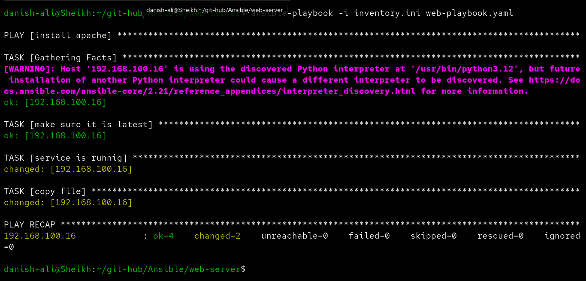
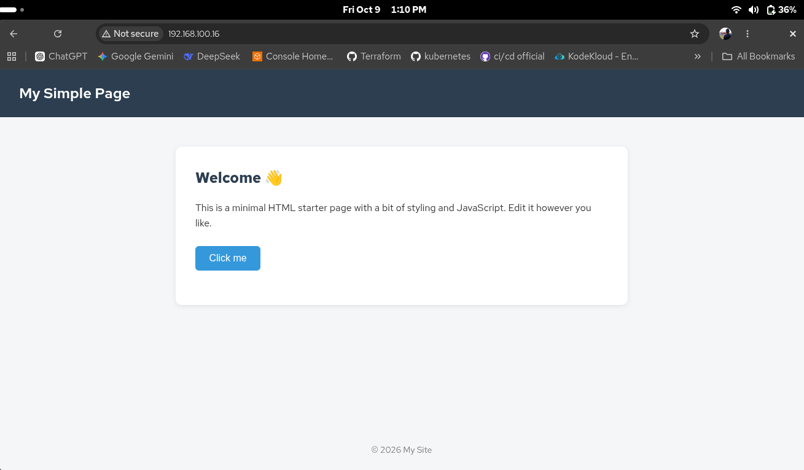

# Ansible Apache Web Server


An Ansible playbook that automates the installation, configuration, and deployment of an Apache web server on a remote host. It ensures Apache is at the latest version, the service is running and enabled on boot, and deploys a custom `index.html` to the web root.

---

## Project Structure

```
web-server/
├── web-playbook.yaml   # Main Ansible playbook
├── inventory.ini       # Inventory file with target host
├── index.html          # HTML file deployed to the web server
├── tasks.png           # Screenshot of playbook tasks output
└── webpage.png         # Screenshot of the deployed webpage
```

---

## Playbook Tasks

The playbook runs the following tasks against the `webserver` group:

| # | Task | Module |
|---|------|--------|
| 1 | Ensure Apache2 is at the latest version | `ansible.builtin.apt` |
| 2 | Ensure Apache2 service is started and enabled | `ansible.builtin.service` |
| 3 | Copy `index.html` to `/var/www/html/` | `ansible.builtin.copy` |

---

## Inventory

```ini
[webserver]
192.168.100.16 ansible_user=danish
```

---

## Usage

**Run the playbook:**

```bash
ansible-playbook -i inventory.ini web-playbook.yaml
```

---

## Playbook Output

```
PLAY [install apache] ******************************************************************

TASK [Gathering Facts] *****************************************************************
ok: [192.168.100.16]

TASK [make sure it is latest] **********************************************************
ok: [192.168.100.16]

TASK [service is runnig] ***************************************************************
ok: [192.168.100.16]

TASK [copy file] ***********************************************************************
ok: [192.168.100.16]

PLAY RECAP *****************************************************************************
192.168.100.16   : ok=4    changed=0    unreachable=0    failed=0    skipped=0    rescued=0    ignored=0
```

---

## Screenshots

### Tasks



### Deployed Webpage


